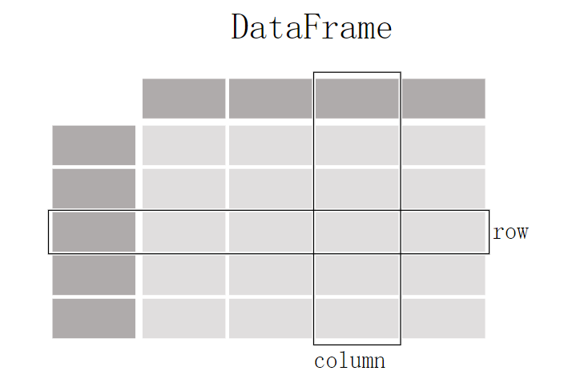

---

title: Pandas, Execel, Csv

date: 2024-07-16 12:00:00 +/-8000

categories: [Python, Pandas]

tags: [Python, Pandas, Data Process]   # TAG names should always be lowercase

author: bulalalla

description: 对Pandas基本数据结构、重要方法的介绍，此外还介绍了Pandas的Excel、csv相关工具用法

---

> **注：撰写此笔记时，pandas的stable版本为2.2**

{: .prompt-info }

## pandas介绍

pandas是一个专门处理 表格式（tabular）数据的python工具包，在Pandas中，一个表格式数据被叫做 ```DataFrame```



### 功能简述

pandas不仅拥有对表格式数据的读写能力，还可以对数据进行绘图、筛选、计算等，本部分对pandas的能力做一个简要的总结，后面再做详细介绍

| 功能     | 描述                                                         |
| -------- | ------------------------------------------------------------ |
| 读写数据 | pandas支持多种类型文件的读写(csv, excel, sql, json, parquet...)，使用函数```read_*```进行读取，```to_*```进行存储 |
| 筛选     | pandas中拥有一些 slicing, selecting, extracting函数，支持数据的分片、选择、提取 |
| 绘图     | pandas也可以对数据进行绘图，得益于Matplotlib库的支持         |
| 插入     | pandas可以通过简单的操作对现有的数据插入新的列/行            |
| 其它     | 数值计算(max, min, mean, counts...)，改变表格结构、合并多个文件、处理时间数据、文本数据处理 |


## pandas 安装

1. 在anaconda环境下

   ```shell
   conda install -c <your_forge_name> pandas
   ```

2. 使用pip从pypi中安装

   ```shell
   # 安装 pandas
   pip install pandas
   # 安装指定的依赖
   pip install "pandas[<依赖包名>]"
   ```

   > 截至目前pandas要求pip版本最低为19.3

   {: .prompt-warning }

3. 安装正在开发的pandas版本

   开发版本通常每天从 anaconda.org 的 PyPI 注册表上传到 Scientific-python-nightly-wheels 索引，可以通过运行来安装它。

   ```shell
   pip install --pre --extra-index https://pypi.anaconda.org/scientific-python-nightly-wheels/simple pandas
   ```

   当你想要卸载一个当前pandas时，执行：

   ```shell
   pip uninstall pandas -y
   # -y 表示yes，不询问是否确定卸载
   ```

### 依赖

依赖可能会随这版本更新改变，若有不同请参考[官网安装教程](https://pandas.pydata.org/docs/getting_started/install.html)

#### 必须依赖

| Package         | 最低支持版本 |
| --------------- | ------------ |
| NumPy           | 1.22.4       |
| python-dateutil | 2.8.2        |
| pytz            | 2020.1       |
| tzdata          | 2022.7       |

#### 可选依赖

pandas 有许多可选依赖项，仅用于特定方法。例如，pandas.read_hdf()需要pytables包，而DataFrame.to_markdown()需要tabulate包。

> 当使用了一些方法需要额外的包，若未安装，则会抛出```ImportError```

{: .prompt-warning}

##### 提高性能的依赖（推荐安装）

```pip install "pandas[performance]"```

| Dependency                                         | Minimum Version | pip extra   | Notes                                                        |
| -------------------------------------------------- | --------------- | ----------- | ------------------------------------------------------------ |
| [numexpr](https://github.com/pydata/numexpr)       | 2.8.4           | performance | 通过使用多核以及智能分块和缓存来加速某些数值运算，以实现大幅加速 |
| [bottleneck](https://github.com/pydata/bottleneck) | 1.3.6           | performance | 通过使用专门的 cython 例程来加速某些类型的`nan`，以实现大幅加速 |
| [numba](https://github.com/numba/numba)            | 0.56.4          | performance | 用于接受 `engine="numba"` 的操作的替代执行引擎，使用 JIT 编译器，使用 LLVM 编译器将 Python 函数转换为优化的机器代码。 |

##### 可视化依赖

```pip install "pandas[plot, output-formatting]"```

| Dependency | Minimum Version | pip extra         | Notes                                                        |
| ---------- | --------------- | ----------------- | ------------------------------------------------------------ |
| matplotlib | 3.6.3           | plot              | Plotting library                                             |
| Jinja2     | 3.1.2           | output-formatting | Conditional formatting with DataFrame.style                  |
| tabulate   | 0.9.0           | output-formatting | Printing in Markdown-friendly format (see [tabulate](https://github.com/astanin/python-tabulate)) |

##### 数值计算处理依赖

 `pip install "pandas[computation]"`

| Dependency | Minimum Version | pip extra   | Notes                                  |
| ---------- | --------------- | ----------- | -------------------------------------- |
| SciPy      | 1.10.0          | computation | Miscellaneous statistical functions    |
| xarray     | 2022.12.0       | computation | pandas-like API for N-dimensional data |

##### Excel依赖

 `pip install "pandas[excel]"`

| Dependency      | Minimum Version | pip extra | Notes                               |
| --------------- | --------------- | --------- | ----------------------------------- |
| xlrd            | 2.0.1           | excel     | Reading Excel                       |
| xlsxwriter      | 3.0.5           | excel     | Writing Excel                       |
| openpyxl        | 3.1.0           | excel     | Reading / writing for xlsx files    |
| pyxlsb          | 1.0.10          | excel     | Reading for xlsb files              |
| python-calamine | 0.1.7           | excel     | Reading for xls/xlsx/xlsb/ods files |

##### HTML依赖

`pip install "pandas[html]"`

| Dependency     | Minimum Version | pip extra | Notes                     |
| -------------- | --------------- | --------- | ------------------------- |
| BeautifulSoup4 | 4.11.2          | html      | HTML parser for read_html |
| html5lib       | 1.1             | html      | HTML parser for read_html |
| lxml           | 4.9.2           | html      | HTML parser for read_html |

One of the following combinations of libraries is needed to use the top-level [`read_html()`](https://pandas.pydata.org/docs/reference/api/pandas.read_html.html#pandas.read_html) function:

- [BeautifulSoup4](https://www.crummy.com/software/BeautifulSoup) and [html5lib](https://github.com/html5lib/html5lib-python)
- [BeautifulSoup4](https://www.crummy.com/software/BeautifulSoup) and [lxml](https://lxml.de/)
- [BeautifulSoup4](https://www.crummy.com/software/BeautifulSoup) and [html5lib](https://github.com/html5lib/html5lib-python) and [lxml](https://lxml.de/)
- Only [lxml](https://lxml.de/), although see [HTML Table Parsing](https://pandas.pydata.org/docs/user_guide/io.html#io-html-gotchas) for reasons as to why you should probably **not** take this approach.

> - if you install [BeautifulSoup4](https://www.crummy.com/software/BeautifulSoup) you must install either [lxml](https://lxml.de/) or [html5lib](https://github.com/html5lib/html5lib-python) or both. [`read_html()`](https://pandas.pydata.org/docs/reference/api/pandas.read_html.html#pandas.read_html) will **not** work with *only* [BeautifulSoup4](https://www.crummy.com/software/BeautifulSoup) installed.
> - You are highly encouraged to read [HTML Table Parsing gotchas](https://pandas.pydata.org/docs/user_guide/io.html#io-html-gotchas). It explains issues surrounding the installation and usage of the above three libraries.
>

{: .prompt-warning}

##### XML依赖

`pip install "pandas[xml]"`

| Dependency | Minimum Version | pip extra | Notes                                               |
| ---------- | --------------- | --------- | --------------------------------------------------- |
| lxml       | 4.9.2           | xml       | XML parser for read_xml and tree builder for to_xml |

##### SQL数据库依赖

 `pip install "pandas[postgresql, mysql, sql-other]"`

| Dependency             | Minimum Version | pip extra                    | Notes                                       |
| ---------------------- | --------------- | ---------------------------- | ------------------------------------------- |
| SQLAlchemy             | 2.0.0           | postgresql, mysql, sql-other | SQL support for databases other than sqlite |
| psycopg2               | 2.9.6           | postgresql                   | PostgreSQL engine for sqlalchemy            |
| pymysql                | 1.0.2           | mysql                        | MySQL engine for sqlalchemy                 |
| adbc-driver-postgresql | 0.8.0           | postgresql                   | ADBC Driver for PostgreSQL                  |
| adbc-driver-sqlite     | 0.8.0           | sql-other                    | ADBC Driver for SQLite                      |

##### 其他类型数据依赖

`pip install "pandas[hdf5, parquet, feather, spss, excel]"`

| Dependency  | Minimum Version | pip extra        | Notes                                                     |
| ----------- | --------------- | ---------------- | --------------------------------------------------------- |
| PyTables    | 3.8.0           | hdf5             | HDF5-based reading / writing                              |
| blosc       | 1.21.3          | hdf5             | Compression for HDF5; only available on `conda`           |
| zlib        |                 | hdf5             | Compression for HDF5                                      |
| fastparquet | 2022.12.0       |                  | Parquet reading / writing (pyarrow is default)            |
| pyarrow     | 10.0.1          | parquet, feather | Parquet, ORC, and feather reading / writing               |
| pyreadstat  | 1.2.0           | spss             | SPSS files (.sav) reading                                 |
| odfpy       | 1.4.1           | excel            | Open document format (.odf, .ods, .odt) reading / writing |

##### 从云中访问数据

 `pip install "pandas[fss, aws, gcp]"`

| Dependency | Minimum Version | pip extra     | Notes                                                        |
| ---------- | --------------- | ------------- | ------------------------------------------------------------ |
| fsspec     | 2022.11.0       | fss, gcp, aws | Handling files aside from simple local and HTTP (required dependency of s3fs, gcsfs). |
| gcsfs      | 2022.11.0       | gcp           | Google Cloud Storage access                                  |
| pandas-gbq | 0.19.0          | gcp           | Google Big Query access                                      |
| s3fs       | 2022.11.0       | aws           | Amazon S3 access                                             |

##### 剪切板

 `pip install "pandas[clipboard]"`.

| Dependency  | Minimum Version | pip extra | Notes         |
| ----------- | --------------- | --------- | ------------- |
| PyQt4/PyQt5 | 5.15.9          | clipboard | Clipboard I/O |
| qtpy        | 2.3.0           | clipboard | Clipboard I/O |

##### 压缩

`pip install "pandas[compression]"`

| Dependency | Minimum Version | pip extra   | Notes                 |
| ---------- | --------------- | ----------- | --------------------- |
| Zstandard  | 0.19.0          | compression | Zstandard compression |

## 基本数据类型

pandas有两种基本数据类型`Series`和`DataFrame`，分别代表一维数据和二维数据

| 维度 | 名字      | 描述                                                 |
| ---- | --------- | ---------------------------------------------------- |
| 1    | Series    | 一维同类型带标签的数组                               |
| 2    | DataFrame | 具有潜在异构类型列的通用二维标记、大小可变的表格结构 |

### Series

Series 是一个一维标记数组，可以保存任何数据类型（整数、字符串、浮点数、Python 对象等）,轴标签统称为索引。

> 可以理解为Excel表格中的一列，Index就相当于Excel中行编号，只不过这里的Index可以不止为数字
>
> 为什么是一列而不是一行呢？因为通常每列数据类型是相同的，Series想表示一组同类型的数据

{: .prompt-tip}

#### 构造Series

`Series` 是一个一维标记数组，能够容纳任何数据类型（整数、字符串、浮点数、Python 对象等）。轴标签统称为`index`。创建 `Series `的基本方法是调用：

```python
s = pd.Series(data, index=index)
```

这里的`data`可以是python的字典、ndarray（n-dimension array，实际上传入的数组必须是1维的）、标量（一个值，比如1），`index`代表数据轴上的标签，根据`data`的不同`index`拥有不同的效果：

##### 当data是字典时

此时可以不传入index，字典对应的key会被对应到每个value的index

```python
In [7]: d = {"b": 1, "a": 0, "c": 2}

In [8]: pd.Series(d)
Out[8]: 
b    1
a    0
c    2
dtype: int64
```

如果传入了index，如

```python
[In 11]: pd.Series(d, index=["b", "c", "d", "a"])
Out[11]: 
b    1.0
c    2.0
d    NaN
a    0.0
dtype: float64
```

> NaN（not a number）是在pandas中缺失数据时使用的标准标记

{: .prompt-tip}

##### 当传入的data是ndarry时

此时index的长度必须与`ndarray`的长度相同（注：不会像dict那样自动填充NaN），data的index会与传入的index对应，如果不传入index默认值会为`[0, ..., len(data)-1]`

```python
In [3]: s = pd.Series(np.random.randn(5), index=["a", "b", "c", "d", "e"])

In [4]: s
Out[4]: 
a    0.469112
b   -0.282863
c   -1.509059
d   -1.135632
e    1.212112
dtype: float64

In [5]: s.index
Out[5]: Index(['a', 'b', 'c', 'd', 'e'], dtype='object')

In [6]: pd.Series(np.random.randn(5))
Out[6]: 
0   -0.173215
1    0.119209
2   -1.044236
3   -0.861849
4   -2.104569
dtype: float64
```

##### 当传入的数据是标量时

此时最好传入index，这个标量的值会被重复到与index的长度一致：

```python
In [12]: pd.Series(5.0, index=["a", "b", "c", "d", "e"])
Out[12]: 
a    5.0
b    5.0
c    5.0
d    5.0
e    5.0
dtype: float64   
# 若不传入index
In [12]: pd.Series(5)
In [13]: print(s.array)
out[13]:
0    1
dtype: int64
```

##### 为什么要用Index？

- **标识和访问数据**：索引为数据点提供了一个唯一的标识，这使得可以通过索引标签来访问特定的数据值。没有索引的话，只能使用位置索引（类似于数组的索引）来访问数据。
- **数据对齐**：索引使得不同`Series`对象之间的数据能够根据索引进行对齐操作。这对于数据运算和合并非常有用。例如，在进行加法运算时，只有索引匹配的数据才会相加。
- **增加数据的描述性**：索引标签可以是字符串、日期、时间等，更加直观地描述数据的含义，而不仅仅是数字位置索引。
- **支持时间序列数据**：索引尤其在处理时间序列数据时非常有用。时间序列数据的索引通常是时间戳，这使得可以方便地进行时间相关的操作，比如重采样和时间切片。

#### Series的使用技巧

##### 像数组一样使用（Index无关型操作）

Series拥有`iloc`属性，它提供通过位置索引（整数索引）的访问和操作`Series`对象的数据。当只关心数据位置而不是标签时非常有用。

`Series.iloc`主要有以下几个作用：

1. **单个元素访问**：可以通过整数索引访问单个元素。
2. **切片操作**：可以通过整数位置进行切片操作，获取一个子集。
3. **布尔索引**：可以通过布尔数组进行索引，获取符合条件的子集。

```python
# 单个元素访问
import pandas as pd

data = [10, 20, 30, 40, 50]
index = ['a', 'b', 'c', 'd', 'e']
series = pd.Series(data, index=index)

# 访问第二个元素
print(series.iloc[1])  # 输出: 20

# 切片操作
# 获取从第2个到第4个元素（不包括第4个）
print(series.iloc[1:3])  

# 输出:
# b    20
# c    30
# dtype: int64

# 使用布尔索引
print(series.iloc[[True, False, True, False, True]])  

# 输出:
# a    10
# c    30
# e    50
# dtype: int64

```

##### 像字典一样使用

`Series`对象可以通过设置的`Index`标签像字典一样访问数据

```python
In [21]: s["a"]
Out[21]: 0.4691122999071863

In [22]: s["e"] = 12.0

In [23]: s
Out[23]: 
a     0.469112
b    -0.282863
c    -1.509059
d    -1.135632
e    12.000000
dtype: float64

In [24]: "e" in s
Out[24]: True

In [25]: "f" in s
Out[25]: False

# 使用get函数
In [27]: s.get("f")

In [28]: s.get("f", np.nan)
Out[28]: nan
```

##### 向量操作--标签自动对齐

当进行两个向量之间的加法操作时（或其他操作），`Series`和Numpy array一样不需要使用循环一个一个的计算，可以直接进行操作：

```python
In [29]: s + s
Out[29]: 
a     0.938225
b    -0.565727
c    -3.018117
d    -2.271265
e    24.000000
dtype: float64

In [30]: s * 2
Out[30]: 
a     0.938225
b    -0.565727
c    -3.018117
d    -2.271265
e    24.000000
dtype: float64

In [31]: np.exp(s)
Out[31]: 
a         1.598575
b         0.753623
c         0.221118
d         0.321219
e    162754.791419
dtype: float64
```

与Numpy不同的是，`Series`会根据Index值自动对齐。此外两个`Series`拥有不同Index也可以进行操作，会自动对其它们重叠的Index，如果一个Index另一个对象没有，则操作结果为 `NaN` ,最终结果的Index为两个对象Index的并集：

```python
In [32]: s.iloc[1:] + s.iloc[:-1]
Out[32]: 
a         NaN
b   -0.565727
c   -3.018117
d   -2.271265
e         NaN
dtype: float64
```

##### name属性

在许多情况下，`Series` 名称可以自动分配，特别是从 DataFrame 中选择单个列时，该名称将被分配列标签。

### DataFrame

`DataFrame` 是一个二维标记数据结构，其列可能具有不同类型的类型。你可以将它想象成电子表格或 SQL 表，或 `Series` 对象的字典。它通常是最常用的 pandas 对象。

#### 构造DataFrame

DataFrame可以接收多种输入：

- 一维数组的字典、lists、dicts或`Series`(**注意复数形式**)
- 二维数组
- 单个`Series`
- 另一个`DataFrame`
- [Structured or record](https://numpy.org/doc/stable/user/basics.rec.html) ndarray

##### 使用value为Series对象的字典构造

字典中`value`为`Series`对象，每个`item`会被视为一列，列名为`item`的`key`，列内容为`Series`，每个`Series`都会有`Index`属性，最终构造出的总`Index`为所有`Index`的并集，若某个`Series`对象无某个`index`，则会填充`NaN`

```python
In [38]: d = {
   ....:     "one": pd.Series([1.0, 2.0, 3.0], index=["a", "b", "c"]),
   ....:     "two": pd.Series([1.0, 2.0, 3.0, 4.0], index=["a", "b", "c", "d"]),
   ....: }
   ....: 
# 直接构造
In [39]: df = pd.DataFrame(d)
In [40]: df
Out[40]: 
   one  two
a  1.0  1.0
b  2.0  2.0
c  3.0  3.0
d  NaN  4.0
# 构造时指定Index，则只会保留传入的Index
In [41]: pd.DataFrame(d, index=["d", "b", "a"])
Out[41]: 
   one  two
d  NaN  4.0
b  2.0  2.0
a  1.0  1.0
# 构造时传入cloumns参数，则只会保留对应key的item
In [42]: pd.DataFrame(d, index=["d", "b", "a"], columns=["two", "three"])
Out[42]: 
   two three
d  4.0   NaN
b  2.0   NaN
a  1.0   NaN
```

##### 使用value为数组/列表的字典构造

此时所有`value`对应的数组，长度一定要相同，否则会抛出`ValueError`。此外如果不传入`Index`，则`Index会`使用`ange(n)`生成，n为长度，如果传入了`Index`，则要保证传入的`Index`长度要与数组长度对应，否则也会抛出`ValueError`

```python
In [45]: d = {"one": [1.0, 2.0, 3.0, 4.0], "two": [4.0, 3.0, 2.0, 1.0]}
# 不传入Index
In [46]: pd.DataFrame(d)
Out[46]: 
   one  two
0  1.0  4.0
1  2.0  3.0
2  3.0  2.0
3  4.0  1.0
# 传入Index
In [47]: pd.DataFrame(d, index=["a", "b", "c", "d"])
Out[47]: 
   one  two
a  1.0  4.0
b  2.0  3.0
c  3.0  2.0
d  4.0  1.0
```

##### 使用dict数组构造

> 使用`dict`构造`Series`对象时，`key`被当作了`Index`，而在此处，`key`会被当做`columns`

{: .pormpt-warning}

```python
In [53]: data2 = [{"a": 1, "b": 2}, {"a": 5, "b": 10, "c": 20}]

In [54]: pd.DataFrame(data2)
Out[54]: 
   a   b     c
0  1   2   NaN
1  5  10  20.0

In [55]: pd.DataFrame(data2, index=["first", "second"])
Out[55]: 
        a   b     c
first   1   2   NaN
second  5  10  20.0

In [56]: pd.DataFrame(data2, columns=["a", "b"])
Out[56]: 
   a   b
0  1   2
1  5  10
```

##### 使用tuple字典构造多级列名/行名

可以按照如下方式进行创建一个`DataFrame`

```python
In [57]: pd.DataFrame(
   ....:     {
   ....:         ("a", "b"): {("A", "B"): 1, ("A", "C"): 2},
   ....:         ("a", "a"): {("A", "C"): 3, ("A", "B"): 4},
   ....:         ("a", "c"): {("A", "B"): 5, ("A", "C"): 6},
   ....:         ("b", "a"): {("A", "C"): 7, ("A", "B"): 8},
   ....:         ("b", "b"): {("A", "D"): 9, ("A", "B"): 10},
   ....:     }
   ....: )
   ....: 
Out[57]: 
       a              b      
       b    a    c    a     b
A B  1.0  4.0  5.0  8.0  10.0
  C  2.0  3.0  6.0  7.0   NaN
  D  NaN  NaN  NaN  NaN   9.0
```

解释：

1. 最外层的key会被解释成列，看前三个item的key分别为("a", "b"), ("a", "a"), ("a", "c")，它们一级列名都是a，二级列名有三个，依次为b, a, c，因此可以看到输出中，2，3，4列刚好是这样的，同理可以推出b为一级列标题的

2. 内层的key会被解释为Index，它们一级行标题只有"A"，因此输出也只有一个A为一级行标题，二级行标题按照第一次出现的顺序排列

3. 在Excel中，这个数据结构对应如图所示

   

   列为 a, b，行为 A, B的值为1，列为 b, b 行为A, B 对应的值为10

   ##### 使用单个Series创建

   因为一个`Series`只代表一列，使用单个`Series`构造的结果也只是一列，并且`Series`的`name`属性会被当做列名，`Index`属性会被保留

   ```python
   In [58]: ser = pd.Series(range(3), index=list("abc"), name="ser")
   
   In [59]: pd.DataFrame(ser)
   Out[59]: 
      ser
   a    0
   b    1
   c    2
   ```


#### DataFrame的使用技巧

##### 根据已有的列计算出一个新的列并插入assign()方法链

DataFrame拥有assign()方法，它可以方便地从现有的列派生出一个新的列并插入，它不会改变原来的DataFrame，而是复制一份插入，然后返回

```python
In [85]: iris = pd.read_csv("data/iris.data")

In [86]: iris.head()
Out[86]: 
   SepalLength  SepalWidth  PetalLength  PetalWidth         Name
0          5.1         3.5          1.4         0.2  Iris-setosa
1          4.9         3.0          1.4         0.2  Iris-setosa
2          4.7         3.2          1.3         0.2  Iris-setosa
3          4.6         3.1          1.5         0.2  Iris-setosa
4          5.0         3.6          1.4         0.2  Iris-setosa

In [87]: iris.assign(sepal_ratio=iris["SepalWidth"] / iris["SepalLength"]).head()
Out[87]: 
   SepalLength  SepalWidth  PetalLength  PetalWidth         Name  sepal_ratio
0          5.1         3.5          1.4         0.2  Iris-setosa     0.686275
1          4.9         3.0          1.4         0.2  Iris-setosa     0.612245
2          4.7         3.2          1.3         0.2  Iris-setosa     0.680851
3          4.6         3.1          1.5         0.2  Iris-setosa     0.673913
4          5.0         3.6          1.4         0.2  Iris-setosa     0.720000
```

也可以传入只有一个参数的函数，这个函数会被用来计算新的列的值

```python
In [88]: iris.assign(sepal_ratio=lambda x: (x["SepalWidth"] / x["SepalLength"])).head()
Out[88]: 
   SepalLength  SepalWidth  PetalLength  PetalWidth         Name  sepal_ratio
0          5.1         3.5          1.4         0.2  Iris-setosa     0.686275
1          4.9         3.0          1.4         0.2  Iris-setosa     0.612245
2          4.7         3.2          1.3         0.2  Iris-setosa     0.680851
3          4.6         3.1          1.5         0.2  Iris-setosa     0.673913
4          5.0         3.6          1.4         0.2  Iris-setosa     0.720000
```

函数的参数是`**kwargs`，是一个字典，这个字典的`key`值会被当做新的列名，`value`值可以直接是想要插入的值（`Series`对象或数组），也可以是一个可以调用的对象，会调用此对象计算新的列的值，`**kwargs`的顺序会被保留，返回值中新的列按照此顺序。

##### 得到某行或某列

| Operation          | Syntax          | Result    |
| ------------------ | --------------- | --------- |
| 选择列             | `df[col]`       | Series    |
| 使用label选择行    | `df.loc[label]` | Series    |
| 使用整数进行行定位 | `df.iloc[loc]`  | Series    |
| 行切片             | `df[5:10]`      | DataFrame |
| 使用bool向量选择行 | `df[bool_vec]`  | DataFrame |

##### 数据对齐和算术

DataFrame 对象之间的数据对齐会自动在列和索引（行标签）上对齐。同样，生成的对象将具有列标签和行标签的并集。

```python
In [94]: df = pd.DataFrame(np.random.randn(10, 4), columns=["A", "B", "C", "D"])

In [95]: df2 = pd.DataFrame(np.random.randn(7, 3), columns=["A", "B", "C"])

In [96]: df + df2
Out[96]: 
          A         B         C   D
0  0.045691 -0.014138  1.380871 NaN
1 -0.955398 -1.501007  0.037181 NaN
2 -0.662690  1.534833 -0.859691 NaN
3 -2.452949  1.237274 -0.133712 NaN
4  1.414490  1.951676 -2.320422 NaN
5 -0.494922 -1.649727 -1.084601 NaN
6 -1.047551 -0.748572 -0.805479 NaN
7       NaN       NaN       NaN NaN
8       NaN       NaN       NaN NaN
9       NaN       NaN       NaN NaN

In [97]: df - df.iloc[0]
Out[97]: 
          A         B         C         D
0  0.000000  0.000000  0.000000  0.000000
1 -1.359261 -0.248717 -0.453372 -1.754659
2  0.253128  0.829678  0.010026 -1.991234
3 -1.311128  0.054325 -1.724913 -1.620544
4  0.573025  1.500742 -0.676070  1.367331
5 -1.741248  0.781993 -1.241620 -2.053136
6 -1.240774 -0.869551 -0.153282  0.000430
7 -0.743894  0.411013 -0.929563 -0.282386
8 -1.194921  1.320690  0.238224 -1.482644
9  2.293786  1.856228  0.773289 -1.446531

In [98]: df * 5 + 2
Out[98]: 
           A         B         C          D
0   3.359299 -0.124862  4.835102   3.381160
1  -3.437003 -1.368449  2.568242  -5.392133
2   4.624938  4.023526  4.885230  -6.575010
3  -3.196342  0.146766 -3.789461  -4.721559
4   6.224426  7.378849  1.454750  10.217815
5  -5.346940  3.785103 -1.373001  -6.884519
6  -2.844569 -4.472618  4.068691   3.383309
7  -0.360173  1.930201  0.187285   1.969232
8  -2.615303  6.478587  6.026220  -4.032059
9  14.828230  9.156280  8.701544  -3.851494

In [99]: 1 / df
Out[99]: 
          A          B         C           D
0  3.678365  -2.353094  1.763605    3.620145
1 -0.919624  -1.484363  8.799067   -0.676395
2  1.904807   2.470934  1.732964   -0.583090
3 -0.962215  -2.697986 -0.863638   -0.743875
4  1.183593   0.929567 -9.170108    0.608434
5 -0.680555   2.800959 -1.482360   -0.562777
6 -1.032084  -0.772485  2.416988    3.614523
7 -2.118489 -71.634509 -2.758294 -162.507295
8 -1.083352   1.116424  1.241860   -0.828904
9  0.389765   0.698687  0.746097   -0.854483

In [100]: df ** 4
Out[100]: 
           A             B         C             D
0   0.005462  3.261689e-02  0.103370  5.822320e-03
1   1.398165  2.059869e-01  0.000167  4.777482e+00
2   0.075962  2.682596e-02  0.110877  8.650845e+00
3   1.166571  1.887302e-02  1.797515  3.265879e+00
4   0.509555  1.339298e+00  0.000141  7.297019e+00
5   4.661717  1.624699e-02  0.207103  9.969092e+00
6   0.881334  2.808277e+00  0.029302  5.858632e-03
7   0.049647  3.797614e-08  0.017276  1.433866e-09
8   0.725974  6.437005e-01  0.420446  2.118275e+00
9  43.329821  4.196326e+00  3.227153  1.875802e+00

In [101]: df1 = pd.DataFrame({"a": [1, 0, 1], "b": [0, 1, 1]}, dtype=bool)

In [102]: df2 = pd.DataFrame({"a": [0, 1, 1], "b": [1, 1, 0]}, dtype=bool)

In [103]: df1 & df2
Out[103]: 
       a      b
0  False  False
1  False   True
2   True  False

In [104]: df1 | df2
Out[104]: 
      a     b
0  True  True
1  True  True
2  True  True

In [105]: df1 ^ df2
Out[105]: 
       a      b
0   True   True
1   True  False
2  False   True

In [106]: -df1
Out[106]: 
       a      b
0  False   True
1   True  False
2  False  False
```

##### 转置

```
# only show the first 5 rows
In [107]: df[:5].T
Out[107]: 
          0         1         2         3         4
A  0.271860 -1.087401  0.524988 -1.039268  0.844885
B -0.424972 -0.673690  0.404705 -0.370647  1.075770
C  0.567020  0.113648  0.577046 -1.157892 -0.109050
D  0.276232 -1.478427 -1.715002 -1.344312  1.643563
```

##### DataFrame可以直接使用Numpy中的大部分函数

##### info(), to_string()等函数进行信息获取

## 重要的函数


## pandas的IO操作（Excel、csv、...）