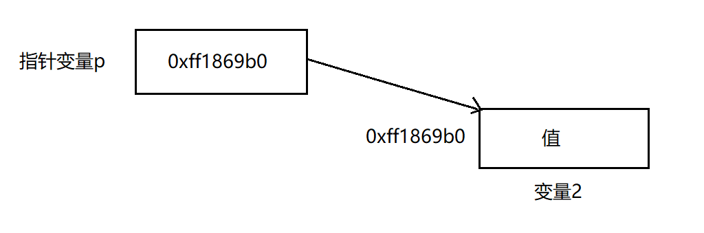

## C语言进阶

### 指针与字符串

#### 指针的使用

##### 指针的作用

指针是什么？为什么要用指针呢？

**指针：**可以理解为一个地址，通过指针能够访问存储在这个地址的变量信息，**指针变量**就是对应变量类型的指针，如 int *p, p为指针变量，p为 int 类型指针

在C语言中，会面临一些问题，使用指针能更好地解决这些问题，比如当想使用swap函数来交换两个变量的值时

```c
// code1: 不使用指针
void swap1(int a, int b) {
    int t = a;
    a = b;
    b = t;
}
// code2: 使用指针
void swap2(int *pa, int *pb) {
    int t = *a;
    *a = *b;
    *b = t;
}
```

C语言函数默认是进行**值传递**的，（值传递是指函数内部会创建新的变量，把传入的参数的值复制给这些新的变量），因此在函数内部对变量进行修改，并不会影响到参数，所以执行如下代码，a，b的值并不会改变

```c
#include <stdio.h>

int main(void) {
    int a = 5;
    int b = 6;
    swap1(a, b);
    printf("a=%d, b=%d\n", a, b);
}
------输出
    a=5, b=6
```

而如果使用指针进行**地址传递**，因为地址在程序中是唯一的，通过地址修改就可以影响到参数的值

```c
#include <stdio.h>

int main(void) {
    int a = 5;
    int b = 6;
    swap2(a, b);
    printf("a=%d, b=%d\n", a, b);
    return 0;
}
------输出
    a=6, b=5
```

###### 需要使用指针的场景

**1. 当一个函数需要有多个返回值**

我们知道在C语言函数中，一个return后面只能有一个返回值，当一个函数有多个结果需要返回时，此时就需要借助指针进行实现。其实刚刚的swap就是一种需要多个返回值的函数，它需要返回交换后的a和b的值。**借助指针，可以不直接在return中给出返回值，而是用指针变量，把返回值带出来。**

一个更明显的例子：

```c
#include <stdio.h>

// 求数组中的最大值和最小值
void minmax(int a[], int len, int *min, int *max);

int main(void) {
    int a[] = {1, 2, 3, 4, 5, 6, 7, 8, 9, 10, 11, 12, 13, 14, 15, 16, 17, 18}
    int min, max;
    minmax(a, sizeof(a)/sizeof(a[0]), &min, &max);
    printf("min=%d, max=%d", min, max);
    return 0;
}

void minmax(int a[], int len, int *min, int *max) {
    int i;
    *min = *max = a[0]
    for (i=1; i < len; i++) {
        if (a[i] < *min)
            *min = a[i]
        if (a[i] > *max)
            *max = a[i]
    }
}
```

返回值通过指针 min 和 max被带出来

**2. 指针用于返回函数的状态**

有些函数的执行完毕后可能会有不同的执行状态（成功、失败、...）,同时还可返回一些结果。通常，**return返回的是执行状态，返回结果通过指针带出。**（不成名的规范，因我return更容易被放到if语句中，if语句可以用来判断运行状态）

例如，除法函数

```c
#include <stdio.h>
/**
	@return 如果成功返回1，否则返回0
*/
int divide(int a, int b, int *result);

int main(void) {
    int a = 5;
    int b = 2;
    int c;
    if (divide(a, b, &c)) {	// return 更容易放在if中
        printf("%d/%d=%d\n", a, b, c);
    }
    return 0;
}

int divide(int a, int b, int *result) {
    int ret = 1;
    if (b == 0) ret = 0;
    else {
        *result = a/b;
    }
    return ret;
}
```

在C语言中，只能通过这种方式来表达出错，其它语言可以使用异常机制，如C++/Java/Python

##### 指针注意事项--野指针

创建一个指针后，却不给这个指针一个明确的地址值，此时这个指针可以被称为**野指针**。任何野指针，都不应该被访问、修改其指向的值，因为野指针指向的位置时随机的，有时可以访问、修改，但这些位置并没有意义（不知道这些位置是变量还是什么，对其更改有危险，还无意义），有时不可以访问，因为有些地址程序不能访问，而这个指针恰好指向了这个地址。**因此在指针被使用前，应该给指针一个明确的、有意义的地址**。

##### 指针与数组

##### 指针和const

const是用来修饰变量的一个关键字，表示这个变量不能被修改，指针变量一方面可以访问到指针变量1对应的地址，另一方面可以访问到地址对应的变量2，当指针变量与const遇到一起时，到底哪部分是const呢？是指针变量的内容（0xff1869bo）不能变，还是指针变量所指的**值**不能变？



**指针是const：**一旦指针指向了某个值，就不能再指向别的地址了

**指针所指的变量是const：**通过此指针，不能修改它所指的**值**的内容

**判别方法**

根据const是位于 *的左边还是右边

```c
// const 位于 *的右边，表明指针是常量，指针不能再指向别的地址
int * const p;
// 不能执行 p = &a;
// 可以执行 *p = 10;
// const 位于 *的左边，表明指针包含的地址所对应的值是常量，不可通过此指针进行修改
const int *p;
int const *p;
// 不能执行 *p = 10; p-> = 10;
// 可以执行 p = &b;
/**
后者可以当做声明来使用，可以在创建函数时使用
void func(const int *a) {
	...
}
这样写的函数，就相当于告诉使用者，你放心把参数传进来，函数内部是不会修改这个参数的值的
*/
```

### 结构类型

#### 枚举 enum

#### 结构 struct

#### 联合 union

### 链表

### 程序结构

### 文件